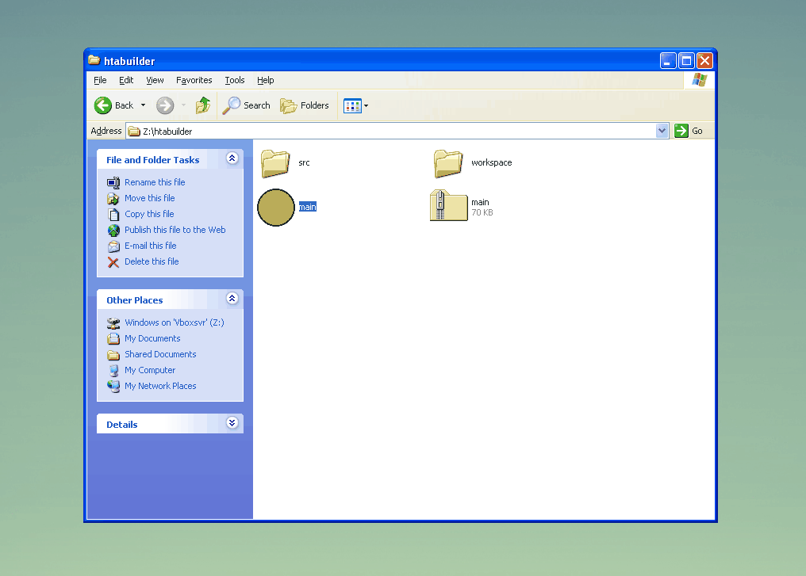

This is an experiment in building Windows applications from LISP source.

```clojure
(m.render document.body
          [(m "h1" "Hello world!")
           (m "button" {:onclick (fn [] (alert "beep"))} "beep")])
```



Electron app's file size got you down?

Properties of the binary produced by this project:

 * Runs on WinXP 32-bit and higher.
 * Is `70kb` zipped.
 * LISP source code - [Wisp](https://gozala.io/wisp/).
 * HTML & CSS renderer.

It works by transpiling the Wisp source code to Javascript and then uses [Microsoft's HTA technology](https://docs.microsoft.com/en-us/previous-versions//ms536496(v=vs.85)) to run natively on Windows.

A small wrapper executable adds an icon and launches the script.

### Build

To build from Linux with mingw32-cross installed: `cd src && make`

The source code is in [core.cljs](./src/core.cljs) and uses Mithril and Wisp to render.

